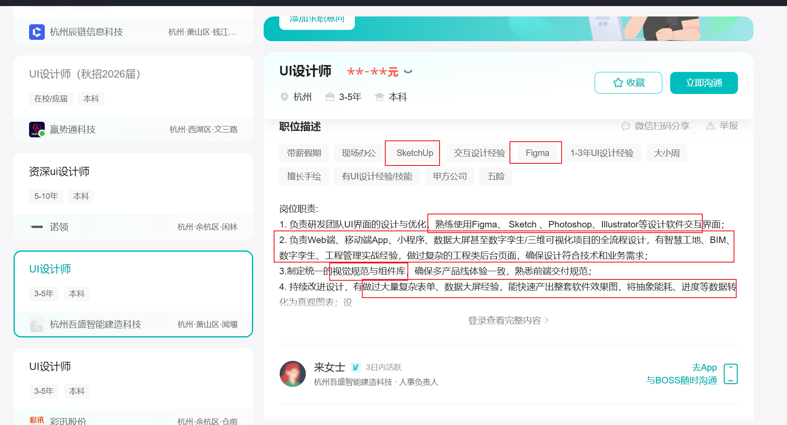

> 前言：对于求职者来说，简历是必不可少的一张门票，这篇文章用于讲述如何写好一份简历，给自己的“门票”升座。
> 
> 

## 一、准备简历模板

在这里直接开门见山，推荐几个优质的简历编辑网站

1. **魔方简历**：https://magicv.art/zh

推荐理由：模板好看、页面清透、开源免费，支持本地存储简历

缺点：自由度较差

2. **木及简历**：https://www.mujicv.com

推荐理由：模板多、简约、自由性高，支持免费导出简历

缺点：上传证件照有大小限制

3. **可画**：https://www.canva.cn

推荐理由：模板众多、自由性高

缺点：难以控制多页简历，限制少不便于快速做简历

尽量选择简约、轻松的简历模板，简历的核心是内容**高效、简洁明了、吸引面试官。**

除此之外，还有简历的版型需要选择，注意 **单栏式 \> 双栏式** 简历。

为什么？因为简历本身更倾向于文案型的，如果是双栏式简历的话，右边的内容会显得比较紧凑，看不了多少就要换行了，而单栏式简历天生适合简历版型，自上往下，不容易分散 HR 注意。

## 二、准备个人信息

个人信息部分主要包括**姓名、电话、邮箱、求职意向**这四个必须写的内容

除此之外还包括：

1. **年龄**：年龄部分最好写 xx岁，不要写 2004、2005 这种，否则 HR 还需要换算，浪费时间。

2. **照片**：形象精神、最好使用职业证件照，建议使用白色、蓝色底色的证件照。

3. **学历**：名校可以突出，双非建议填写xx届本科xxxx专业即可

4. **博客（个人作品集）**：技术岗写博客，设计师填个人作品集，可以不填。

5. **GitHub**：如果 commit 过少，或者没有什么贡献最好不要填

6. **邮箱**：最好使用 https://mail.163.com 邮箱或者谷歌邮箱，显得比较专业，QQ 邮箱不太建议。

其中注意，可以**根据自己岗位的需求**来稍微修改个人信息的内容。假如你的岗位十分需要你体现认真负责，你又恰好是中共预备党员/党员，那么可以写在简历中，如果你只是应对技术岗、设计类，技术要求高的岗位，那么政治身份可以不写，写了反而会增加信息量。

## 三、了解专业术语

在进行接下来的相关技能、以及工作、实习经验前，我们先来讲一讲什么是 JD，什么是 STAR 法则，什么又是 ATS 以便于我们的简历撰写。

首先我们来讲一件什么是 ATS 系统。

### ATS 系统

**ATS = Applicant Tracking System** ，中文：**简历筛选系统 / 招聘管理系统**

这是简历筛选的第一关，特别是在中大厂中

### JD（求职 / 职场最常用含义）

**JD = Job Description**，中文：**职位描述、岗位说明书**，就是我们所说的招聘网站上的岗位招聘详情页。

我们在写简历的时候通常需要将招聘岗位的 JD 里的关键词（技术栈、项目能力）塞进简历中，提高被 HR、ATS系统筛选出来的概率。

### **STAR 法则**

**STAR法则**是一种结构化描述个人经历和成就的方法，主要包括以下四个部分：

- **情境（Situation）**：描述具体的工作或项目情境。

- **任务（Task）**：明确在该情境中的任务目标或面临的挑战。

- **行动（Action）**：详细阐述采取的具体行动步骤。

- **结果（Result）**：指出行动带来的结果，包括成功指标或所学到的经验教训。

|角色|普通写法（差）|STAR 法（优）|
|---|---|---|
|后端|负责订单系统的后端开发，使用了Redis做缓存，提升了系统性能|主导订单微服务重构（Spring Boot \+ Redis \+ RocketMQ），针对库存扣减并发问题引入Redis \+ Lua原子操作，支撑活动期间3000\+ QPS，接口响应时间从600ms降至90ms|
|前端|参与了公司官网前端开发，做了性能优化|基于React 18 \+ Zustand重构C端首页，采用虚拟列表优化长列表渲染，FCP从3\.2s降至1\.1s，Lighthouse评分从54提升至88|
|设计|负责APP 商品详情页 UI 改版|主导电商APP详情页改版，通过10场用户访谈发现3大体验痛点，重构信息架构后商品点击率提升20%，用户停留时长增加15%|

**例如**：基于React 18 \+ Zustand重构C端首页，采用虚拟列表优化长列表渲染，FCP从3\.2s降至1\.1s，Lighthouse评分从54提升至88

> S：首页性能糟糕，FCP3\.2s，Lighthouse54 分 
> 
> T：重构首页并优化长列表渲染性能 
> 
> A：React18\+Zustand 重构 \+ 虚拟列表优化长列表 
> 
> R：FCP=1\.1s，Lighthouse=88 分
> 
> 

## 四、准备相关技能

相关技能，在**程序员**的角度来说就是技术栈，而在设计师等其余行业中，相关技能就是所会的工具、技能。那么对于相关技能模块的编写来说，还是按照 STAR 法则来进行编写。

### 寻找需要的技能

在**编写相关技能**部分，你需要先学习如何来找到你需要会什么技能。找到需要会什么技能最快的方法就是在各大招聘平台根据 JD 来进行编写简历。

实战一下：

可以写成 ↓

1. 界面设计工具：熟练使用 **Figma、Sketch** 完成 UI 界面搭建、组件化管理、多人协同协作；精通 Photoshop、Illustrator 做视觉插画、图标绘制、图片精修与矢量图形输出

2. 三维辅助工具：掌握 **SketchUp**，可配合 BIM、智慧工地类项目做简易三维场景建模，支撑数字孪生可视化视觉落地

3. 多终端全链路 UI 设计：可独立完成 Web 后台、移动端 APP、微信小程序、数据大屏、数字孪生 / 三维可视化项目全流程 UI 输出

4. 行业专项经验：具备**智慧工地、BIM、工程管理、数字孪生**项目实战经验，擅长复杂工程类管理后台、工程项目管理系统界面设计，懂工程业务逻辑与技术落地约束

### 如何写相关技能

对于程序员来说通用模板是：

- **了解**：使⽤过某⼀项技术，能在别⼈指导下完成⼯作，但不能胜任复杂⼯作，也不能独⽴解决问题。 

- **熟悉/熟练掌握**：⼤量运⽤过的某⼀项技术，能独⽴完成⼯作，且能独⽴完成有⼀定复杂度的⼯作，在技术的应⽤层⾯不会有太⼤问题，甚⾄理解⼀点原理。 

- **精通**：不仅可以运⽤某⼀⻔技术完成复杂项⽬，⽽且理解这项技术背后的原理，可以对此技术进⾏⼆次开发，甚⾄本身就是技术源码的贡献者。 

应届生写熟悉和精通就可以了，不然在面试中问更深层次会增加面试难度。其中需要注意，主要写熟悉，了解只用于拓展或者实在不熟练度技能。

嵌套在 STAR 法则中，你可以写成：
熟悉 **AI Agent 工具**提效（Claude Code、Codex、WorkBuddy 等），具备 **AI 工作流**与 **Prompt Engineering** 实践经验，能将 AI 能力融入开发全流程。

对于设计师以及其他岗位，你可以写成：

- 设计工具/基本技能：要写具体的工具名称，不要笼统写"设计软件"。

- 用户研究：可用性测试、数据分析基础（热力图等）、用户旅程地图、用户画像。

- 交互与视觉设计：线框图、交互原型、响应式设计、Mobile\-First 设计等。

然而这里，最推荐的还是 STAR 法则。例如：

精通 **Figma/Sketch** 等主流设计工具，熟悉全链路设计流程（用户调研、交互原型、视觉稿及交付），熟练运用** Midjourney/ChatGPT img2 **等AI工具提效，了解 HTML/CSS，能与开发高效协同。

## 五、 准备工作经历

以后再说

## 六、准备项目经历

项目经历对于没有工作经验的校招生来说，是非常重要的一个环节，它可以直接被 HR 拿来当做你**是否有经验、是否可以满足公司项目要求以及是否会使用该工具**的一个重要评价基准。

### **项目经历标准**

合格的项⽬经历必须要有以下⼏点： 

- **项目概述** ：基于xxx开发的xxx项目，有xxx作用。

- **个人职责** ：作为前端开发

- **项目难点**：遇到了xxxx问题，使用xxx手段，达到了xxx效果

- **工作成果**

### **不要空谈、流水账**

**例如**：用 Figma 设计了一个简历网页 ❌️

**使用 STAR 法则**：基于 Figma 独立完成个人简历网页 UI 视觉与交互设计，输出规范交付文件支持前端还原。 ✅️

### **控制项目的量**

不要写太多没有含金量的项目，将最重要的 **1\~2 个项目**写在简历中即可。

## 七、其他注意事项

### 教育经历

这个模块是必须要写的模块，不过要根据个人情况来写。如果你是 985/211 的学生，你可以在简历中突出自己的名校身份，如果你是不知名双非或者学院本，那么建议你将教育经历放在**简历的最后面或者倒数第二的位置**。因为这样的话，HR 可以先看到你的项目经历以及技能，用好的先遮住不好的，不会上来就扣分。

### **其他问题**

- **自我评价**：不需要写，0 个人看。

- **图文**：别搞花里胡哨的图片呀、svg图呀、emoji等，这些只会干扰 ATS 系统来筛选你的简历。

- **证书**：如果想写可以写在教育经历部分，其余地方一律不写，写了还扣分会觉得你没啥好写的。

- **是否一页**：不一定，如果你是普通校招生，那么简历一面即可了，假如说你有很多优秀的项目、工作经历，那么写两页纸也是可以的。

### 简历排版问题

- 程序员 推荐结构

1. **个人信息**（姓名、电话、邮箱、GitHub/博客）

2. **专业技能**（分类列出，含熟练度标注）

3. **工作/实习经历**（STAR量化）

4. **项目经历**（开源项目、Side Project）

5. **教育背景**（学校、专业、学位、时间）

6. **附加**（获奖、证书）

- UI设计师 推荐结构

1. **个人信息**（姓名、电话、邮箱、作品集链接）

2. **个人简述**（2\-3句话，突出设计方向与核心理念）

3. **核心技能**（分类：设计工具/用户研究/交互/规范）

4. **工作/项目经历**（STAR量化，突出设计思维与数据成果）

5. **作品集亮点**（1\-2句话概括3个代表项目\+链接）

6. **教育背景**

其中你需要注意：无论是程序员还是设计师亦或者其他岗位，这些排版都是可以灵活变换的，特别是**相关技能**部分，如果在 boss 直聘投递，那么建议你放在最上面，可以给 HR 一眼扫到技能的机会，如果是在官网投递（企业的官网），那么可以不用把相关技能放在上面，因为大厂有 ATS 系统，会筛选之后再看简历，这时候你就可以优先展示你的经历以及经验。